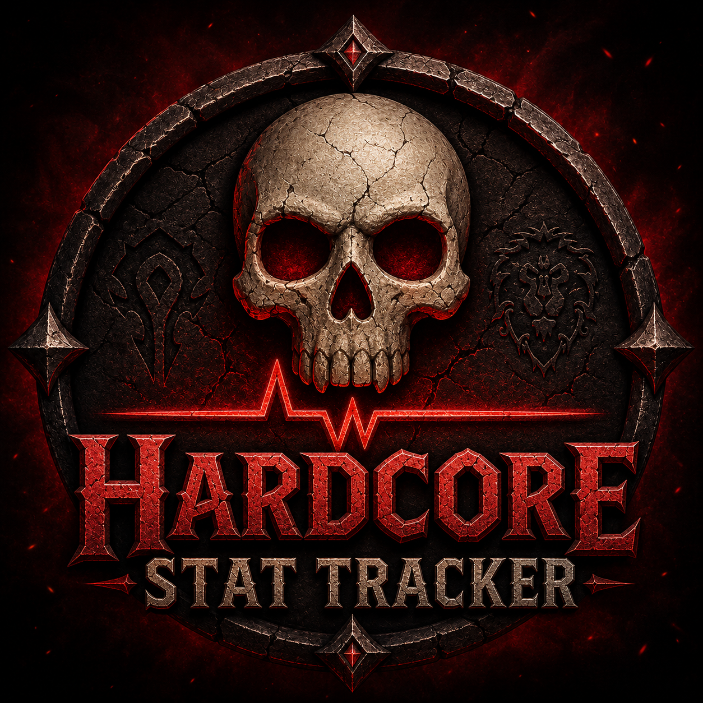

# Hardcore Stat Tracker

**A trophy case for your hardcore character.** Hardcore Stat Tracker quietly records your closest calls, biggest hits, toughest kills, and the rest of your run's defining moments, and shows them in a compact on-screen panel and a detailed full window. Built for **WoW Classic Era / Hardcore (1.15.x)**.

## Features

- **Survival records** — Closest Call (lowest HP% + the raw number), Nearest Death (how many seconds from dying you were, based on incoming DPS), Biggest Hit Taken, Highest Fall (as a share of your max HP at impact — a number that actually means something across levels), Clutch Saves, Untouched Streak, Most Foes at Once, Panic Moments, Fights Survived, Total Damage Taken.
- **Combat records** — Highest Crit, Biggest Melee / Ranged / Spell / Ability Hit (physical "yellow" abilities like Sinister Strike or Aimed Shot are tracked apart from real spells), Killing Blows, Total Damage Done, Longest Fight, Most Damage Taken in One Fight, Toughest Foe (highest level above you that you took on).
- **Healing records** — Biggest Heal, Total Healing (effective, overheal excluded), and Players Saved (a direct heal that pulled a critically-low party member back from the brink).
- **Pet & group** — current pet, pet deaths (with a log), Pet Killing Blows (tracked separately for pet-only challenges), party-member deaths you witnessed, and buffs you've put on other players.
- **Wealth** — Gold Earned (lifetime income — loot, quests, vendoring), Gold Spent (lifetime outgo — vendor buys, repairs, training, postage), Gold Looted (coin straight off kills and loot), and Bags Looted (containers looted off corpses and chests — never the ones you buy).
- **Adventure** — quests completed, zones explored, jumps made (for fun), and Time Alive (your `/played`, which for a hardcore character *is* your time alive).
- **Account milestones (account-wide)** — Highest Level reached, Level 60s (how many of your characters have hit max level), and Characters Drowned (because it happens).
- **Mak'gora (account-wide)** — duels won and lost, persisting across all your characters.
- **Mob tooltips (account-wide)** — hover a mob and see "Has hit you for up to X (at lvl Y)" if it's hurt any of your characters before. Your new character inherits the warnings.
- **Memorial roll** — an account-wide list of your fallen heroes. When a character dies, their card is saved (level, time survived, what felled them and where, headline records). Browse the whole roll, click any name to read their card, and Share it to chat. No deaths yet? The page cheers you on to keep it that way. Open with the skull on the full window or `/hst memorial`.
- **Records integrity (anti-fake)** — the full window shows how many times this character's records have been reset, and runs an integrity check on the saved file. If the `SavedVariables` were hand-edited outside the game, the character is flagged. *(This catches casual file edits — it is a deterrent, not unbreakable tamper-proofing.)*
- **Comic splashes** — optional fun: a comic-book **POW! / BOOM! / ZAP!** pops on screen when you set a new record (crit / melee / ranged by default). Each of the six slots can be turned off, dragged anywhere, linked to any record stat, and given its own sound.
- **Famous Last Words** — optional: when you drop low, broadcast a cocky/ironic line to chat (built-in surprise pool + your own messages) and/or fire an attention alert (screen flash + sound). Independent thresholds for the chat line and the alert.
- **Record announcements** — optional, two separate streams: new personal bests go to **party / say** a few seconds after a fight you survive (never raid, with a per-fight cap so it stays rare); and an opt-in **guild** line only for genuine clutch survivals (dropping to ≤5% HP and living), rate-limited and never fired from the grave.
- **Two views** — a customizable mini panel (pick exactly which stats show; pets default to pet classes only) and a designed full window, organized into **Combat / World / Account** tabs, with icons, a color-coded danger bar, per-stat explanation tooltips, "new!" highlights on fresh records, and Escape-to-close. Anything you enable on the mini panel also shows in the full window — even in sections it would otherwise hide for your class.
- **Quick Settings** — the full window's **Display** button opens a popup with live scale and background-opacity sliders for both the mini panel and the full window.
- **Adjustable** — text size, panel scale, background opacity, draggable frames, full per-stat visibility control.

## Installation

1. Download and unzip into `World of Warcraft/_classic_era_/Interface/AddOns/`.
2. Make sure the folder is named `HardcoreStatTracker` and contains the `.toc`.
3. `/reload` or restart the game.

## Usage

- The mini panel appears on screen — drag it anywhere.
- Click the `[+]` button (or `/hst full`) for the full window with every stat and its context.
- `/hst` opens settings; `/hst config` jumps straight there.

## Slash commands

- `/hst` — toggle the mini panel
- `/hst full` — open the full window
- `/hst config` — open settings
- `/hst splashes` — enter placement mode to drag the comic splashes
- `/hst welcome` — show the welcome window again
- `/hst memorial` — show this character's death memorial
- `/hst share [say|party|guild|raid|yell]` — post a one-line stat summary to chat
- `/hst reset` — clear this character's records (account-wide Mak'gora is kept)
- `/hst makgora won|lost` — manually record a Mak'gora result
- `/hst makgora debug` — print the raw Mak'gora system message (to refine auto-detection)

`/hcstats` and `/hc` still work as aliases for `/hst`.

## Notes

- Stats are **per-character** (each new hardcore character starts fresh) except **Mak'gora**, which is account-wide.
- Text matching for Famous Last Words and a few records is tuned for an **English (enUS)** client.
- Auto chat to `/say` uses the next keypress (a hardware-event requirement), so it fires the moment you press anything after dropping low.

## License

MIT — see [LICENSE](LICENSE).
